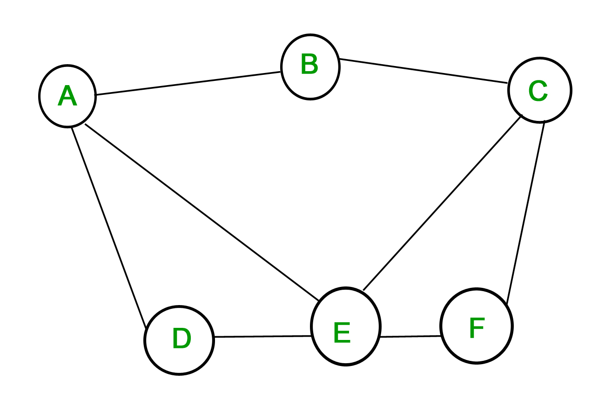

# 2019331073

### Question Setter

Name: **Mufassir Ahmad Chowdhury**  
Registration \# **2019331073**  
Session: _2019-20_  
GitHub Username: _@Mufassir-Chowdhury_  
Cell: _+8801771144308_ Email: _mac22214u@gmail.com_

## Question Set with Answers


Shahjalal University of Science and Technology  
Department of Computer Science and Engineering  
1st Year 1st Semester Final Examination — June 2020 \(Session 2019-20\)  
Course No. — **CSE 133** Course Title — **Structured Programming Language**  
Time — **3 Hours** Credit: **3.00** Total Marks \# **100**

\(Answer all the questions\)

### Group A

1. Answer the following Questions in short. \(Any **Five**\).5 × 2 = 10

\(a\) Will This compile? If it does, explain why.

**source.c**

```c
#include<stdio.h>

int main(){
  printf("I made it");
  return 0;
#include"header.h"
```

**header.h**

```c
}
```

> **Answer:** The code will compile finely because the preprocessor will put all the contents in the place it is included before compiling.

\(b\) If the first element of an array `m[4][5]` has the memory address of `0061FE80`, then What will be the address of the element at `m[3][4]`?

> **Answer:** `0061FECC`

\(c\) What will be the output for the following program.

```c
#include<stdio.h>

int main(){
  char string[100];
  scanf("%s", string);
  printf("%s", string);
  return 0;
}
```

For the input: `What will be the output?`

> **Answer:** `What`

\(d\) Calculate the digits of an integer with `sprintf()` function. The syntax is `int __cdecl snprintf(char *_Buffer, const size_t _BufferCount, const char *_Format, ...)`

> **Answer:**
>
> ```c
> int digits = sprintf(NULL, 0, "%d", integer);
> ```
>
> \(e\) Write down all the variants of the `int` data type. **Answer:** `short`, `long`, `long long`, `unsigned`, `unsigned long`, `unsigned long long`, `unsigned short`, `signed`, `signed long long`, `signed long`, `signed short`.

\(f\) Give an example of the ternary operator.

> **Answer:** `n%2 == 0 ? "Even" : "Odd";`

\(g\) Which of the memory segment arrays allocated with `malloc()` resides?

> **Answer:** `heap`

\(h\) Explain the arguments passed to the `main()`.

> **Answer:**  
> `int argc` = number of arguments. `char * argv[]` = array of armunets. `char * envp[]` = array of environment variables.

1. Answer the following Questions. \(Any **Four**\).4 × 5 = 20

\(a\) Write code to convert a binary string to an integer using bitwise operation \(binary string ends with `b`\).

> **Answer:**
>
> ```c
> unsigned binary_to_int(char *binary) {
>  unsigned result = 0;
>  for (char *i=binary; *i!= 'b'; *i++)
>    if (*i == '1' || *i == '0') {
>      result <<= 1;
>      if (*i == '1') result |= 1;
>    } else {
>        printf("%c", i);
>        return 0;
>    }
>  return result;
> }
> ```

\(b\) Write two functions of the following syntax which implements mathematical exponentiation but one of them must be iterative and another be recursive. Which will be more efficient and why? `int pow(int base, int exponent)`

> **Answer:**
>
> ```c
> int power(int base, int exponent){
>    int result = 1;
>    while(exponent--)
>        result *= base;
>    return result;
> }
> ```
>
> ```c
> int power(int base, int exponent){
>    if (exponent)
>        return base*raised_to_the_power(base, exponent-1);
>    return (int)base != 0;
> }
> ```
>
> The first one is more efficient because calling funcions requires putting new function scope on the stack and popping it afterwards.

\(c\) Implement a function returning `GCD` of two integers using Euclidean algorithm.

> **Answer:**
>
> ```c
> int gcd(int a, int b){
>    if(b == 0) return a;
>    return gcd(b, a%b);
> }
> ```

\(d\) Write down any of the two representations of the following graph:

> 
>
> **Example Answer:**
>
> | O | A | B | C | D | E | F |
> | :--- | :--- | :--- | :--- | :--- | :--- | :--- |
> | A | 0 | 1 | 0 | 1 | 1 | 0 |
> | B | 1 | 0 | 1 | 0 | 0 | 0 |
> | C | 0 | 1 | 0 | 0 | 1 | 1 |
> | D | 1 | 0 | 0 | 0 | 1 | 0 |
> | E | 1 | 0 | 1 | 1 | 0 | 1 |
> | F | 0 | 0 | 1 | 0 | 1 | 0 |

\(e\) Define the four storage class specifiers i.e. `extern`, `auto`, `register`, `static`.

> **Answer:** `extern` tells the compiler to look for the declaration of a variable outside of current scope. `auto` is a variable available only in the current scope and gets destroyed when the code gets out of scope. `register` suggests the compiler to store the variable in the register of the CPU and can be ignored by the CPU. `static` variable is available only in the current scope but doesn't get destroyed until the end of the program.

\(f\) Write a function which takes the current time as input as `mm/dd/yy hh:mm:ss` and prints their own lines.

> **Answer:**
>
> ```c
> void sec(const char* time){
>    int day, month, year, hour, minute, second;
>    sscanf(time, "%d/%d/%d %d:%d:%d", &day, &month, &year, &hour, &minute, &second);
>    printf("%d\n%d\n%d\n%d\n%d\n%d\n", day, month, year, hour, minute, second);
> }
> ```

1. Answer the following Questions. \(Any **Two**\).2 × 10 = 20

\(a\) Write names of 5 sorting algorithms. Write the code of one of them which sorts an array of `n` elements.

> **Answer:** Name of 5 sorting algorithms are: 1. Bubble sort 2. Insertion sort 3. Selection sort 4. Marge sort 5. Heap sort
>
> ```c
> void bubble_sort(long list[], long n){
>   long c, d, t;
>   for (c = 0 ; c < n - 1; c++) {
>      for (d = 0 ; d < n - c - 1; d++) {
>         if (list[d] > list[d+1]) {
>           t         = list[d];
>           list[d]   = list[d+1];
>           list[d+1] = t;
>         }
>      }
>   }
> }
> ```

\(b\) Implement a function which takes an array marking the prime numbers from 1 to 100.

> **Answer:**
>
> ```c
> void prime_generator(bool *sieve){
>    sieve[0] = false;
>    sieve[1] = false;
>    for(int i=2; i*i<=100; i++)
>        if(sieve[i])
>        for(int j=2*i; j<=100; j+=i)
>            sieve[j] = false;
> }
> ```

\(c\) Write a function\(s\) to create a pascal triangle \(leading and trailing spaces are not necessary\).

> **Example Answer:**
>
> ```c
> int factorial(int n){
>    int mult = 1;
>    for(int i=2; i<=n; i++)
>        mult *= i;
>    return mult;
> }
>
> int combination(int n, int r){
>    return factorial(n)/(factorial(n-r)*factorial(r));
> }
>
> void pascal_triangle(int row){
>    for(int i=1; i<=row; i++)
>        for(int j=1; j<=i; j++)
>            printf("%d%c", combination(i-1, j-1), " \n"[i==j]);
> }
> ```

### Group B

1. Answer the following Questions in short. \(Any **Five**\).5 × 2 = 10

\(a\) Our codebase is split in two dependent files, `main.c` and `additional.c`. Write the command to compile both files.

> **Answer:** `gcc main.c additional.c`

\(b\) We have a pointer `p` which points to a two dimensional array of 4 rows and 5 columns. How would you access the last element with pointer arithmetic.

> **Answer:** `*(*(p+3)+4)`

\(c\) What will be the output?

```c
int value = 1<<31;
printf("%d", value);
```

> **Answer:** `-2147483648`

\(d\) Which is the size of `char` data type. How to convert a `char` digit to integer using arithmetic operators.

> **Answer:** `char` uses 1 byte. `digit - 0`

\(e\) What is `-11%3`?

> **Answer:** `-2`

\(f\) How to take a string as an input until user inputs a digit only using format specifiers.

> **Answer:** `scanf("%[^0-9]", string);`

\(g\) What will be the value of `x` after `This line`.

```c
void increment(int x){ x++; }

int main(){
  int x = 4;
  increment(x); // This line
  return 0;
}
```

> **Answer:** `4`

\(h\) What will be the size of the following `union`:

```c
union example {
  int i;
  char ch;
}
```

> **Answer:** `4`

1. Answer the following Questions. \(Any **Four**\).4 × 5 = 20

\(a\) Change the minimum amount of code in `print.h` to compile this file:

**main.c**

```c
#include"headers.h"
#include"print.h"

int main(){
    out("message");
    return 0;
}
```

**print.h**

```c
void out(const char *message){
    printf("%s", message);
}
```

**header.h**

```c
#include<stdio.h>
#include"print.h"
```

> **Answer:** Use `#pragma once` on top or use `#ifndef` preprocessor directive.

\(b\) Create an enumarator which assigns the seven colors of the rainbow values from 0 to 6 \(In any order\). Write a function which returns an array of the values of the enum and is orthogonal to the enum \(Doesn't change when the values or the size of enum is changed\).

> **Answer:**
>
> ```c
> enum colors {
>    VIOLET,
>    YELLOW,
>    BLUE,
>    RED,
>    INDIGO,
>    ORANGE,
>    GREEN,
>    LAST
> }
>
> int main(){
>    int values[LAST];
>    for(int i=0; i<LAST; i++)
>        values[i] = i;
>
>    return 0;
> }
> ```

\(c\) Write down the `struct` which represents singly linked-list using self-referential structure \(without any functionality\).

> **Answer:**
>
> ```c
> struct node{
>  int x;
>  struct node *n;
> };
> ```

\(d\) Write code to compute `n` fibonacci numbers.

> **Answer:**
>
> ```c
> int fib(int n) { 
>    if (n <= 1) 
>        return n; 
>    return fib(n - 1) + fib(n - 2); 
> }
> ```

\(e\) Write down the conditional statement for checking leap years.

> **Answer:**
>
> ```c
> bool is_leap = (year%4 == 0 && year%100 != 0) || (year%400 == 0);
> ```

\(f\) Write a function which calculates the area of a triangle and prints it with 2 digits after the decimal point \(the length of the sides are given\).

> **Example Answer:**
>
> ```c
> void area(double a, double b, double c){
>   double s = (a+b+c)/2.;
>   area = sqrt(s*(s-a)*(s-b)*(s-c));
>   printf("%.2lf", area);
> }
> ```

1. Answer the following Questions. \(Any **Two**\).2 × 10 = 20

\(a\) Write down the code of the tower of Hanoi problem and point out the three laws of recursion.

> **Answer:**
>
> ```c
> void hanoi(int n, char fr, char tr, char ar){
>    if (n == 1){
>        printf("\n Move disk 1 from rod %c to rod %c", fr, tr);
>        return;
>    }
>    hanoi(n-1, fr, ar, tr);
>    printf("\n Move disk %d from rod %c to rod %c", n, fr, tr);
>    hanoi(n-1, ar, tr, fr);
> }
> ```
>
> The three laws are: 1. Calls itself recursively - line 5 and line 7 2. Has a base case - line 2 3. Changes it's state towards the base case - `n-1` in line 5 and line 7

\(b\) Implement linear search and binary search and compare their complexity.

> **Answer:**
>
> ```c
> int linear_search(int arr[], int n, int x) { 
>    for (int i = 0; i < n; i++) 
>        if (arr[i] == x) 
>            return i; 
>    return -1; 
> }
> ```
>
> ```c
> int binary_search(int arr[], int l, int r, int x) { 
>    if (r >= l) { 
>        int mid = l + (r - l) / 2; 
>        if (arr[mid] == x) 
>            return mid; 
>        if (arr[mid] > x) 
>            return binarySearch(arr, l, mid - 1, x); 
>
>        return binarySearch(arr, mid + 1, r, x); 
>    } 
>    return -1; 
> }
> ```
>
> 1. Linear search has the complexity of `n`
> 2. Binary search has the complexity of `logn` though the array must be sorted.

\(c\) Write a program which makes a new copy of `original.txt`.

> **Example Answer:**
>
> ```c
> #include<stdio.h>
> #include<stdlib.h>
>
> int main(){
>    FILE *in, *out;
>    char ch;
>    in = fopen("original.txt", "rb");
>    out = fopen("Copy of original.txt", "wb");
>
>    while(!feof(in)){
>        ch = getc(in);
>        if(!feof(in))
>            putc(ch, out);
>    }
>
>    fclose(in);
>    fclose(out);
>    return 0;
> }
> ```

### END

* [x] I am declaring that, the above work is my own work. Whatever added above

  except the template is the result of my brainstorming. I also understand that

  submitting work that isn’t my own may result in permanent failure of this course

  as well as the whole current semester.

